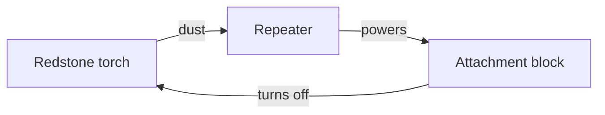

# Circuit gallery

Runnable circuits from [`examples/`](../examples). Run any with
`uv run --package grimmcraft-redstone python examples/<name>.py`.

## Lever → lamp (`lever_lamp.py`)

A lever powering a lamp through four dust. Note the attenuation.

```
Lever ── dust ── dust ── dust ── dust ── Lamp
 15      15      14      13      12       (lit)
```

## 2-tick clock (`clock.py`)

`Clock(period=2)` flips every 2 game ticks. The simulator reports it as
oscillating instead of hanging:

```
tick 1: off   tick 2: ON   tick 3: ON   tick 4: off  …
run_until_stable → oscillating=True, period=4
```

The primitive equivalent is a torch whose output feeds back to its own
attachment block through a repeater:



## Half-adder (`half_adder.py`)

`sum = A ⊕ B`, `carry = A ∧ B`, built from an `XorGate` and an `AndGate`:

```
A ─┬─────────► XOR ─► sum
   │        ┌►
B ─┼────────┘
   └───────► AND ─► carry
A ─────────►
```

| A | B | sum | carry |
| - | - | --- | ----- |
| 0 | 0 | 0 | 0 |
| 0 | 1 | 1 | 0 |
| 1 | 0 | 1 | 0 |
| 1 | 1 | 0 | 1 |

## T-flip-flop (`t_flip_flop.py`)

Each button press toggles a latched output — implemented as a small custom
component to show how to extend the model:

```
press 1 → ON     press 2 → off     press 3 → ON     press 4 → off
```

## Primitive gate builds (reference)

The gate components model these layouts:

| Gate | Primitive build |
| --- | --- |
| NOT | one redstone torch on the input block |
| AND | two torches (invert each input) feeding a torch NOR → i.e. `¬(¬a ∨ ¬b)` |
| OR | two inputs onto one dust line |
| NAND | AND without the final inversion |
| XOR | the classic 4-torch difference gate |
